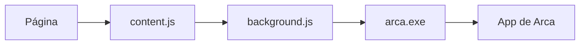

# Arca para el navegador

[English](README.md)

Rellena, sugiere y guarda contraseñas con la app de escritorio.
Chrome, Edge y Firefox. Sin servidor: habla con Arca en tu equipo.

[La app de escritorio](https://github.com/gbaldessari/arca-app)

## Qué hace

| Rellena | Sugiere | Guarda |
| --- | --- | --- |
| En un formulario de acceso ofrece las entradas de Arca para ese sitio. | En un alta propone una contraseña generada por la app y la repite en la confirmación. | Después de enviar un formulario, pregunta si la contraseña nueva entra a la bóveda. |

El popup lista las entradas del sitio abierto, rellena la pestaña, copia una contraseña y genera otra. Copiar pasa por la app: queda fuera del historial de Windows y se borra a los 30 segundos.

La extensión no descifra nada y no guarda la bóveda. Si Arca está cerrada o bloqueada, el menú de la página y el popup pueden abrirla y desbloquearla con la contraseña maestra o con Windows Hello. Los textos siguen el idioma del navegador.

## Cómo se conecta

`content.js` corre en páginas `https` y en `http://localhost` y `http://127.0.0.1`. Reconoce los campos de usuario y contraseña. No lee el resto de la página hasta que enviás el formulario o pedís rellenar.

`background.js` es el único que habla con la app, por native messaging. Descarta cualquier mensaje que no venga de esta extensión. El host se llama `com.arca.vault`: la app lo registra al activar la integración y lo borra al desactivarla. El `arca.exe` que arranca el navegador no abre la ventana. Reenvía el mensaje a la app que ya está corriendo, por un puerto local cuya clave cambia en cada arranque.

La URL la informa el navegador, no la página. Un sitio no puede pedir las contraseñas de otro cambiando el mensaje.

| Mensaje | Cuándo | Qué responde Arca |
| --- | --- | --- |
| `logins` | Al enfocar un campo de acceso | Título y usuario de ese sitio, sin contraseñas |
| `fill` | Al elegir una entrada | Usuario y contraseña, si la entrada es de ese sitio |
| `generate` | Al pedir una contraseña segura | 20 caracteres, generados por la app |
| `captured` y `save` | Tras enviar un formulario | Nada, una entrada nueva o una actualización |
| `copy` | Desde el popup | La app copia la contraseña y no la devuelve |

El menú y el aviso de guardar viven en un shadow DOM cerrado. La página no puede leerlos. Esos controles solo responden a clics y teclas reales del navegador. El estilo sigue el modo claro u oscuro del sistema.

## Instalar

1. Abrí Arca, desbloqueá la bóveda y activá **Integración con el navegador** en Ajustes.
2. En Chrome o Edge, entrá a `chrome://extensions` o `edge://extensions`, activá el modo desarrollador y cargá esta carpeta.
3. En Firefox 128 o posterior, entrá a `about:debugging#/runtime/this-firefox` y cargá `manifest.json` como complemento temporal.

El campo `key` del manifiesto es la clave pública que fija el identificador de Chrome y Edge sin empaquetar. Edge Add-ons usa otro, `peadbjdjjofiieihgijnjhlnmpeihiok`. La app acepta los dos, y en Firefox solo el id `arca@arca.vault`. Sin la app de esta versión, la extensión no tiene con quién hablar.

El paquete de Edge Add-ons es [store/Arca.zip](store/Arca.zip), armado con `pack-edge.ps1`. La tienda rechaza `key` y `background.scripts`, así que ese zip los omite. Cargar esta carpeta para desarrollo sigue usando ambos.

## Permisos

| Permiso | Para qué |
| --- | --- |
| `nativeMessaging` | Hablar con el host `com.arca.vault`. |
| `storage` | Guardar un usuario y una contraseña en memoria hasta 3 minutos, hasta que guardes o descartes, y recordar si Windows Hello es el desbloqueo por defecto. |
| `activeTab` | Conocer la URL de la pestaña actual en el popup. |

No pide el historial ni el contenido de todas las pestañas. El script de contenido está declarado para todo `https` porque no se puede saber de antemano dónde hay un formulario.

## Privacidad

[Política de privacidad](PRIVACY.es.md). Los usuarios y las contraseñas se quedan en esta computadora. La ficha de Edge Add-ons enlaza a esa página.

## Licencia

Software libre bajo la [GNU GPL v3](LICENSE), solo la versión 3, igual que la app. Se puede usar, estudiar, modificar y compartir. Quien distribuya una versión modificada tiene que publicar el código bajo la misma licencia.

Copyright © 2026 Giacomo Baldessari.
