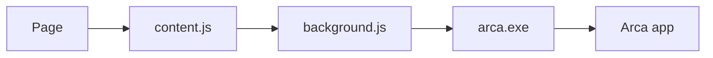

# Arca for the browser

[Español](README.es.md)

Fills, suggests, and saves passwords with the desktop app.
Chrome, Edge, and Firefox. No server: it talks to Arca on your computer.

[The desktop app](https://github.com/gbaldessari/arca-app)

## What it does

| Fills | Suggests | Saves |
| --- | --- | --- |
| On a sign-in form it offers the Arca entries for that site. | On a sign-up form it suggests a password generated by the app and repeats it in the confirmation field. | After you submit a form, it asks whether the new password should go into the vault. |

The popup lists the entries for the open site, fills the tab, copies a password, and generates another. Copying goes through the app: it stays out of Windows history and is cleared after 30 seconds.

The extension does not decrypt anything and does not store the vault. If Arca is closed or locked, the page menu and the popup can open it and unlock it with the master password or with Windows Hello. The text follows the browser language.

## How it connects

`content.js` runs on `https` pages and on `http://localhost` and `http://127.0.0.1`. It recognizes username and password fields. It does not read the rest of the page until you submit the form or ask it to fill.

`background.js` is the only part that talks to the app, over native messaging. It drops any message that does not come from this extension. The host is named `com.arca.vault`: the app registers it when you turn integration on and removes it when you turn integration off. The `arca.exe` that the browser starts does not open the window. It forwards the message to the app that is already running, over a local port whose key changes on every launch.

The browser reports the URL, not the page. A site cannot ask for another site's passwords by changing the message.

| Message | When | What Arca answers |
| --- | --- | --- |
| `logins` | When a sign-in field is focused | Title and username for that site, without passwords |
| `fill` | When you choose an entry | Username and password, if the entry belongs to that site |
| `generate` | When you ask for a secure password | 20 characters, generated by the app |
| `captured` and `save` | After a form is submitted | Nothing, a new entry, or an update |
| `copy` | From the popup | The app copies the password and does not return it |

The menu and the save prompt live in a closed shadow DOM. The page cannot read them. Those controls only respond to real browser clicks and keystrokes. The style follows the system light or dark mode.

## Install

1. Open Arca, unlock the vault, and turn on **Browser integration** in Settings.
2. In Chrome or Edge, open `chrome://extensions` or `edge://extensions`, turn on developer mode, and load this folder.
3. In Firefox 128 or later, open `about:debugging#/runtime/this-firefox` and load `manifest.json` as a temporary add-on.

The `key` field in the manifest is the public key that pins the Chrome and Edge identifier. The app only accepts that origin, and on Firefox only the id `arca@arca.vault`. Without the app from this version, the extension has nobody to talk to.

## Permissions

| Permission | What it is for |
| --- | --- |
| `nativeMessaging` | Talk to the `com.arca.vault` host. |
| `storage` | Hold a username and password in memory for up to 3 minutes, until you save or dismiss, and remember whether Windows Hello is the default unlock. |
| `activeTab` | Know the current tab's URL in the popup. |

It does not ask for history or the contents of every tab. The content script is declared for all of `https` because there is no way to know in advance where a form will be.

## Privacy

[Privacy policy](PRIVACY.md). Usernames and passwords stay on this computer. The Edge Add-ons listing links to that page.

## License

Free software under the [GNU GPL v3](LICENSE), version 3 only, the same as the app. You can use, study, modify, and share it. Anyone who distributes a modified version must publish the source code under the same license.

Copyright © 2026 Giacomo Baldessari.
